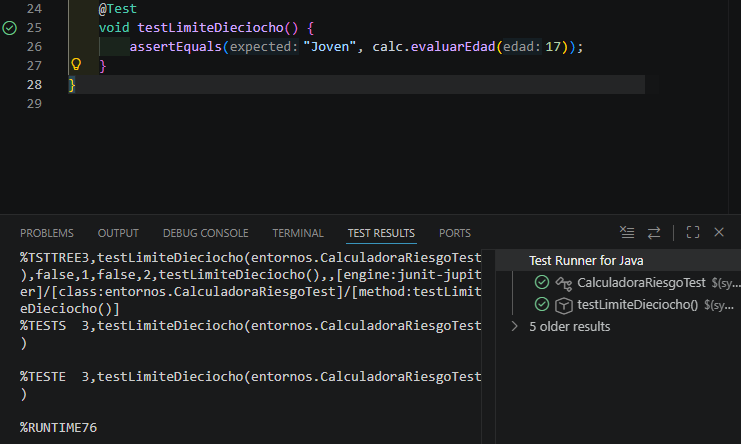
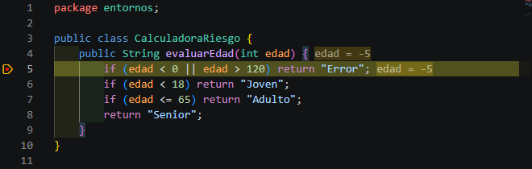

# 🧮 Proyecto: Calculadora de Riesgo (DAM)


Este proyecto forma parte de la práctica del módulo **Entornos de Desarrollo**, enfocada en la implementación de un flujo de trabajo profesional utilizando **JUnit 5** y **Maven** en Visual Studio Code.

## 🚀 Características Principales

* **Gestión de dependencias**: Configuración mediante `pom.xml` optimizada para el motor de JUnit 5.
* **Lógica de Negocio**: Evaluación dinámica de perfiles de riesgo basada en la edad.
* **Testing Unitario**: Cobertura total de casos límite y perfiles específicos.
* **Herramientas de IDE**: Uso avanzado de Testing Explorer, CodeLens y Debugging paso a paso.

## 📂 Estructura del Proyecto

```text
test-vscode/
├── .vscode/                 # Configuración del entorno del IDE
├── src/
│   ├── main/java/entornos/  # Lógica: CalculadoraRiesgo.java
│   └── test/java/entornos/  # Pruebas: CalculadoraRiesgoTest.java
├── pom.xml                  # Configuración de Maven y JDK 25
├── README.md                # Documentación del proyecto
├── TestMatriz.png           # Captura: Testing Explorer (El "Matraz")
├── TestCodelens.png         # Captura: Ejecución individual por CodeLens
└── TestDebugger.png         # Captura: Punto de interrupción y depuración
```
## 🧪 Pruebas Unitarias Realizadas

| Caso de Prueba | Descripción | Resultado |
| :--- | :--- | :---: |
| `testEdadNegativa` | Manejo de excepciones en entradas menores a 0 | ✅ |
| `testAdulto` | Validación del rango estándar de edad | ✅ |
| `testSenior` | Caso específico para mayores de 65 años | ✅ |
| `testLimiteDieciocho` | Verificación de frontera en la mayoría de edad | ✅ |

### ✅ Evidencia de ejecución (Testing Explorer)

|  
|  |

## 🛠️ Entorno Técnico

| Componente | Especificación |
| :--- | :--- |
| **JDK** | 25 (Eclipse Adoptium) |
| **IDE** | Visual Studio Code |
| **Build Tool** | Apache Maven |
| **Workstation** | Ejecutado en el entorno de **David** 💻 |

---
*Desarrollado para el módulo de Entornos de Desarrollo - 2026*